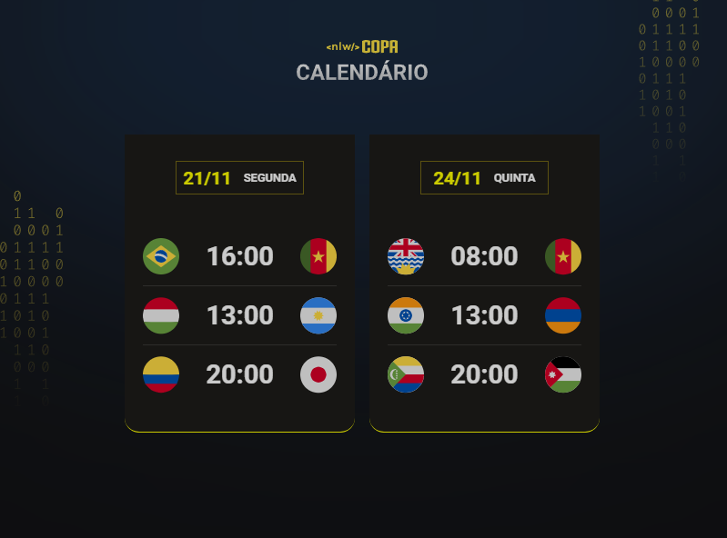

<h1 align="center"> NLW #10 Copa </h1>

    Evento exclusivo, promovido pela rocketseat para ensino de tecnologias WEB.

  

[😊⭐⭐Clique aqui para acessar⭐⭐😊](https://romeusorionaet.github.io/NLW-COPA/)

## 🚀Tecnologias
- HTML 
- CSS 
- JAVASCRIPT

## 💻Projeto

Calendário da Copa é um projeto que mostra os jogos da Copa de 2022.
